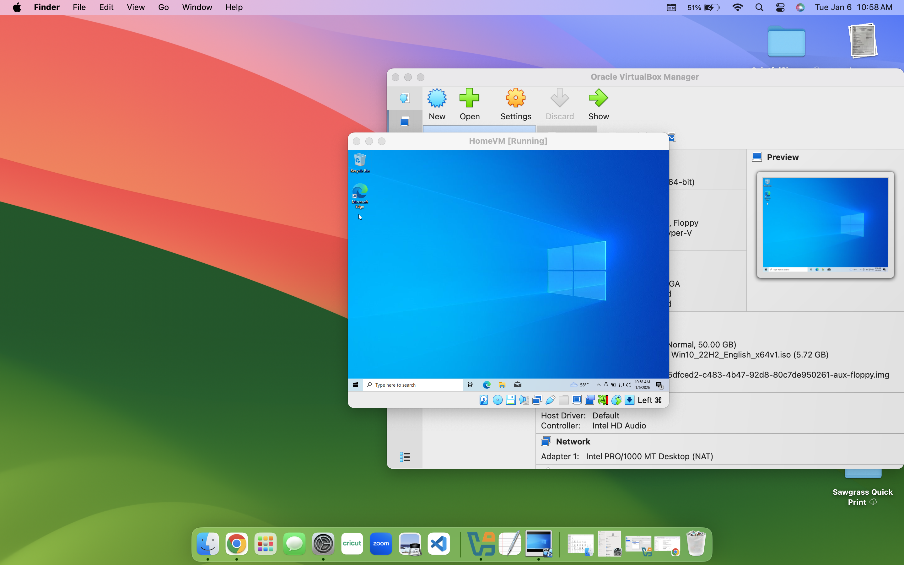
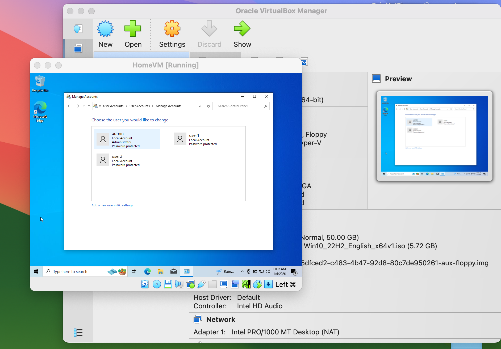
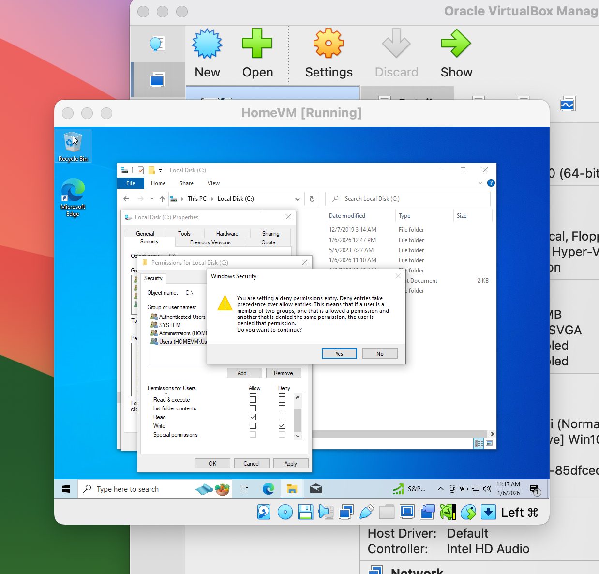

# HomeVMLab — User Management

## What I Did
I set up a **Windows 10 VM on my Mac** to practice user management, just like in a real IT environment.  

To get it running, I first had to **mount the Windows ISO** so the machine could boot, and I made sure to **allocate 50 GB of storage** so it would actually work without slowing my Mac down. Once the VM was up and running, I created:

- One **Administrator account** with full permissions  
- Two **standard user accounts** (`user1` and `user2`) with limited permissions

After that, I created a folder in the admin account and logged in as `user1` and `user2` to make sure they could **only read the folder** and not make changes. Everything worked perfectly.  

I also took snapshots of the VM along the way so I could always roll back if something went wrong.

## Lessons Learned
- Admin vs. standard user privileges and why they matter  
- How to set up folder permissions and control access  
- Running Windows on a Mac via a virtual machine  
- Why documenting each step is important for IT work

## Screenshots

  
  

## Key Skills Demonstrated
- VirtualBox virtualization  
- Windows user account management  
- File/folder permission setup  
- macOS-hosted Windows environment
